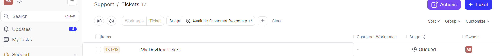

# Using the DevRev API

## Overview

This README provides an overview of how to utilize the DevRev API to interact with the DevRev platform programmatically. The DevRev API allows you to perform various actions such as creating, updating, and retrieving work items like issues, tickets, and tasks.

## Getting Started

To get started with the DevRev API, you'll need the following:

- DevRev account: Sign up at [DevRev](https://www.devrev.ai/) if you haven't already.
- API Key: Generate an PAT API key from your DevRev account settings. This key will be used to authenticate API requests.

## Making API Requests

API requests to DevRev are made over HTTPS to the base URL `https://api.devrev.ai/`. Each request must include the API key in the `Authorization` header.

### Example Request (Python)

```python
import requests

url = "https://api.devrev.ai/works.create"
headers = {
    "Authorization": "<YOUR_API_KEY>",
    "Content-Type": "application/json"
}
payload = {
    "type": "ticket",
    "applies_to_part": "PROD-1",
    "owned_by": ["DEVU-1"],
    "title": "New Ticket"
}

response = requests.post(url, json=payload, headers=headers)
```
## Images

### Screenshot 1: Successful API Request


### Screenshot 2: Newly Created Ticket


